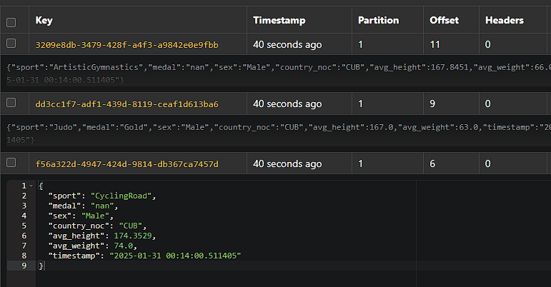
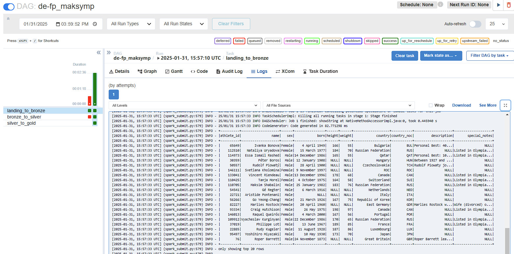
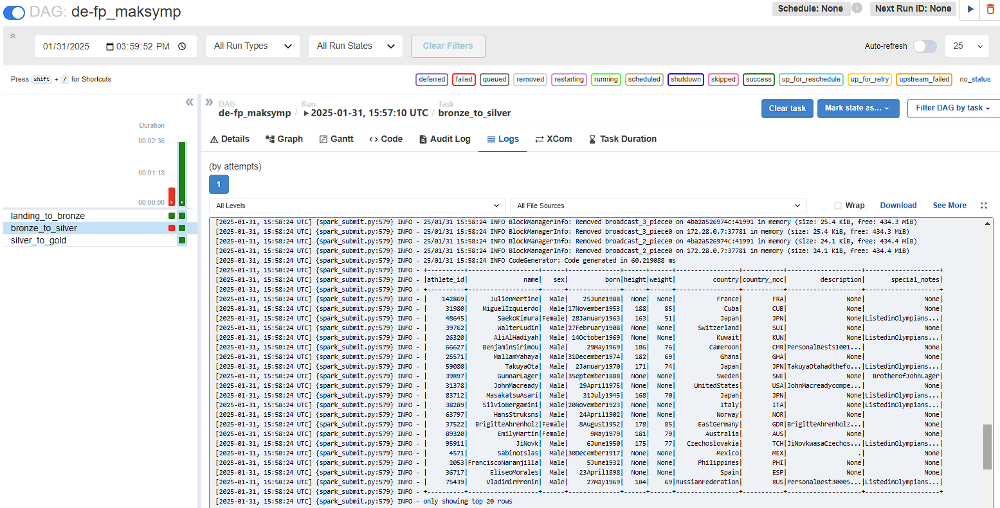
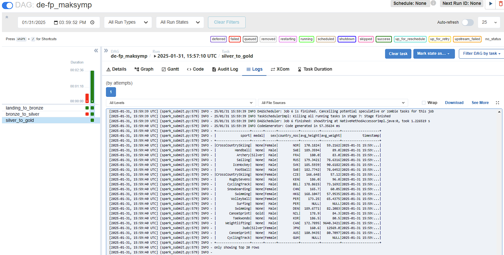
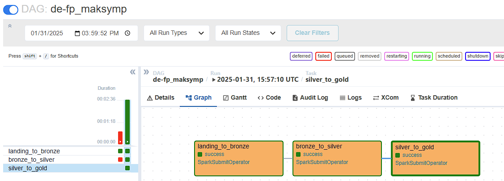

# Final project. Data Engineering.

*All code with screenshots is in [fp.ipynb](./fp.ipynb)*

## Part 1. Building an End-to-End Streaming Pipeline

Entire code is in file [stream_pipline.py](./stream_pipline.py)

#### Kafka

#### MySQL

## Part 2. Building an End-to-End Batch Data Lake

### 2.1. Landing to Bronze

Code is in file [landing_to_bronze.py](./landing_to_bronze.py)

### 2.2. Bronze to Silver

Code is in file [bronze_to_silver.py](./bronze_to_silver.py)

### 2.3. Silver to Gold

Code is in file [silver_to_gold.py](./silver_to_gold.py)

### 2.4. Create DAG

Code is in file [project_solution.py](./project_solution.py)

